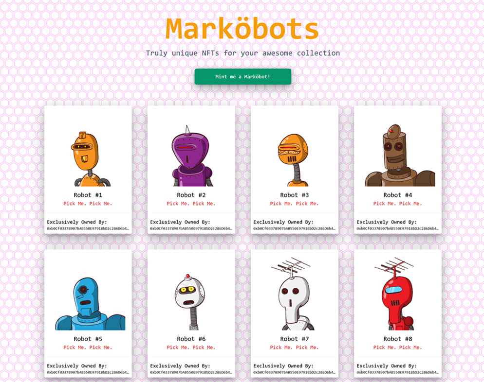

# Getting Started with Create React App

This project was bootstrapped with [Create React App](https://github.com/facebook/create-react-app).

To fulfil the Blockchain Beginner course requirement for SGBT4 by P7210027 Mark Tan

Snapshot of Markobot Homepage:

Set up a .env file with the following lines (you will require an Alchemy account):
    
    ALCHEMY_KEY="Alchemy Rinkeby API"

An [ERC721 contract generator](https://github.com/markvelous/Markobots-ERC721) is available to recreate new Markobots contract (after the 11th unique Markobots) on the Rinkeby Testnet

## Initiate the app

From the project directory: 

### `yarn start`

Run the app in the development mode

View in the browser at [http://localhost:3000](http://localhost:3000)

If yarn fails to execute, run 
### npm install -D tailwindcss@npm:@tailwindcss/postcss7-compat postcss@^7 autoprefixer@^9 

The page will automatically reload when edits are made

### `yarn test`

Launches the test runner in the interactive watch mode
See the section about [running tests](https://facebook.github.io/create-react-app/docs/running-tests) for more information.

### `yarn build`

Builds the app for production to the `build` folder
It correctly bundles React in production mode and optimizes the build for best performance

The build is minified and the filenames include the hashes
Your app is ready to be deployed!

See [deployment](https://facebook.github.io/create-react-app/docs/deployment) for more information

### `yarn eject`

**Note: this is a one-way operation. Once you `eject`, you can’t go back!**

If you aren’t satisfied with the build tool and configuration choices, you can `eject` at any time. This command will remove the single build dependency from your project.
